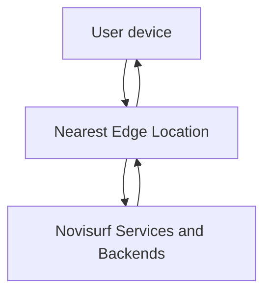

## What is the Novisurf Edge Network?

The Novisurf Edge Network is a globally distributed layer of edge locations that terminate incoming requests close to your users and route them to the right backend or service. Instead of every request traveling to a single origin region, traffic enters at the nearest edge point of presence and then fans in to Storage, KV, Edge Config, or your application backends.

By moving request handling closer to users, the edge network reduces round-trip times, smooths out traffic spikes, and gives you a place to run low-latency logic that sits in front of your core services.

## Why the edge network matters

The edge network exists to make your applications feel faster and more resilient without changing your core architecture.

- **Lower latency** — Terminate TLS and handle routing at an edge location near the user so fewer network hops stand between the client and your data.

- **Higher availability** — If a single origin or path is slow or unavailable, the edge can retry or route to alternative backends when your architecture supports it.

- **Automatic scaling** — Edge locations handle many concurrent connections and absorb bursts, so your origins focus on the work that only they can do.

- **Caching and offload** — Cache responses and static content at the edge to reduce repeated load on origins and shorten response times for popular assets.

- **Security and traffic shaping** — Centralise rate limiting, request validation, and access control checks closer to users before traffic reaches sensitive backends.

<Callout kind="info" collapsed="false">
  Keep edge logic focused on fast operations: routing, lightweight authentication, header rewriting, and small config or KV reads. Avoid heavy compute or large blocking operations at the edge to preserve latency benefits.
</Callout>

## How the edge network relates to Storage, KV, and Edge Config

Edge services in Novisurf all rely on the same underlying edge network, but they focus on different kinds of data and workloads.

### Storage: public file delivery at the edge

Novisurf Storage serves public assets through a dedicated storage domain so you can deliver files from the edge without managing your own CDN.

Public files use URLs such as:

```text
https://blobs.novisurf.top/{bucket}/{filename}
```

When a user requests a public file URL:

1. The request hits the nearest edge location on the Novisurf Edge Network.

2. The edge location fetches the file from Storage if it is not already cached locally.

3. The file response flows back to the user from the edge, not from a distant origin.

Typical uses include:

- Serving profile images, marketing graphics, and UI assets in web and mobile apps.

- Hosting downloadable content like reports, archives, or media files.

- Embedding static assets directly in HTML or CSS using the Storage URL pattern.

### KV: low-latency ephemeral data

Novisurf KV is a low-latency key-value store designed for ephemeral or fast-changing data. Each entry has a key, a JSON-serialisable value, and a required TTL (time-to-live), after which it expires automatically.

When you read from KV at the edge, you:

- Keep **session tokens**, **rate-limit counters**, or **short-lived cache entries** close to users.

- Reduce the number of trips back to a central database for data that does not need long-term persistence.

- Implement per-user or per-region logic in edge workers using quick KV lookups.

Because KV is designed for fast reads and writes with TTL, it pairs naturally with the edge network for tasks like throttling, caching small JSON blobs, and tracking temporary state.

### Edge Config: runtime configuration at the edge

Novisurf Edge Config is a persistent JSON configuration store with no TTL and named keys (for example, `firewallaccess`) mapping to JSON values of any shape. It is built for runtime configuration that your edge workers or backend services read as part of handling each request.

Through Edge Config at the edge, you can:

- Toggle **feature flags** without redeploying code and have changes take effect globally as configurations propagate.

- Maintain **access control lists** that gate specific routes or API operations.

- Control **A/B test parameters** or environment-specific settings that multiple services share.

While KV focuses on short-lived, expiring data, Edge Config holds durable configuration you use across many requests over time. The edge network lets both of these stores be read near users so you do not pay extra latency for configuration or ephemeral state.

## How requests flow through the edge

A typical request path through the Novisurf Edge Network looks like this:



At a high level:

1. **User device** — A browser, mobile app, or server sends an HTTP request to a Novisurf endpoint or Storage URL.

2. **Nearest edge location** — The request terminates at the closest edge point of presence, which:

   - Performs TLS termination and basic request validation.

   - Runs any configured edge logic or Dreamscript snippets.

   - Reads configuration from Edge Config and ephemeral data from KV as needed.

   - Serves cached content directly when possible.

3. **Novisurf services and backends** — For cache misses or non-edge operations, the edge forwards the request to Storage, databases, or your application backends, then relays the response back through the same edge location to the user.

This flow keeps the majority of network and decision-making work close to users while preserving a clear separation between edge concerns and core business logic.

## Common developer use cases

Developers typically rely on the edge network for a set of repeatable patterns:

- **Static asset delivery** — Serve public images, styles, and scripts from Storage URLs, benefiting from edge caching and short request paths.

- **Runtime feature flags** — Read feature flag values from Edge Config in edge logic to decide which code path a request should follow.

- **Access control and gating** — Combine KV for session or token state with Edge Config rules to allow or deny traffic before it reaches sensitive backends.

- **Rate limiting and abuse prevention** — Use KV counters at the edge to track request rates per IP or token and respond early when thresholds are exceeded.

- **Regional behaviour** — Adjust responses based on user location or edge metadata, such as selecting the nearest backend region or tailoring content to geography.

These patterns keep per-request decisions fast and close to the client while reserving heavy work for specialised services behind the edge.

## Next steps

Explore related guides to start using the edge network effectively in your projects.

<Columns cols="3">
  <Card title="Quickstart" href="/quickstart" icon="rocket" horizontal="false">
    Walk through creating a project and sending your first requests through the Novisurf Edge Network.
  </Card>

  <Card title="Edge Config" href="/edgeconfigguide" icon="settings" horizontal="false">
    Learn how to store and read runtime configuration from Edge Config in edge workers and backends.
  </Card>

  <Card title="Key-Value storage" href="/key-value-storage" icon="database" horizontal="false">
    See how to use Novisurf KV for low-latency, TTL-based data alongside your edge logic.
  </Card>
</Columns>

