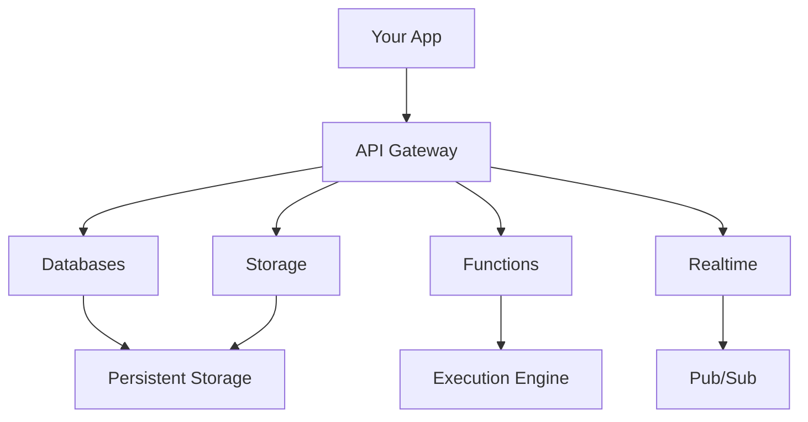

## Overview

Dreambase provides a unified platform for building modern applications with built-in backend services. You get scalable databases, secure storage, serverless functions, and realtime capabilities—all managed from a single dashboard. This architecture eliminates the need to provision separate infrastructure, letting you focus on your code.

<Callout kind="info">
Dreambase follows a multi-tenant cloud model where your projects are isolated for security and performance.
</Callout>

## Platform Architecture

Dreambase uses a layered architecture: your application interacts with the API gateway, which routes requests to core services like databases, storage, and functions. Realtime updates flow through a pub/sub system.



This design ensures low-latency responses and automatic scaling.

## Key Services

Explore Dreambase's core services through these feature cards.

<Columns cols={3}>
  <Card title="Databases" icon="database" href="#databases">
    Flexible document and relational databases with powerful querying.
  </Card>
  <Card title="Storage" icon="hard-drive" href="#storage">
    Secure file handling with transformations and previews.
  </Card>
  <Card title="Functions" icon="code" href="#functions">
    Serverless compute in multiple runtimes.
  </Card>
</Columns>

## Databases and Data Modeling

Databases in Dreambase support document collections with JSON-like documents. You define attributes, indexes, and relationships for efficient queries.

### Data Modeling Example

Create a collection for users:

<CodeGroup tabs="JavaScript,Python">
  ```javascript
  const sdk = new Dreambase.Client();
  sdk.account.create('unique()', 'user@example.com', 'password');
  const users = sdk.database.createCollection('users', 'Users');
  ```
  ```python
  from dreambase import Client
  client = Client()
  users = client.database.create_collection(
      database_id='default',
      collection_id='users',
      name='Users'
  )
  ```
</CodeGroup>

Use indexes for fast lookups on fields like `email` or `createdAt`.

<Expandable title="Advanced Modeling" default-open="false">
Dreambase supports relational modeling via links between collections. Define relationships as one-to-one, one-to-many, or many-to-many.
</Expandable>

## Storage and File Management

Store user uploads, images, or assets securely. Files are encrypted at rest, and you can apply transformations like resizing.

### Upload Workflow

```javascript
const file = sdk.storage.createFile(
  'uploads',
  'image.jpg',
  inputFile
);
```

Permissions control read/write access per bucket.

## Serverless Functions and Realtime

### Functions

Deploy code that runs on triggers like HTTP requests or database events. Supported runtimes include Node.js, Deno, and Python.

<Tabs>
  <Tab title="Node.js" icon="nodejs">
    ```javascript
    module.exports = async (req, res) => {
      res.json({ message: 'Hello from Dreambase!' });
    };
    ```
  </Tab>
  <Tab title="Python" icon="python">
    ```python
    def main(req):
        return {'message': 'Hello from Dreambase!'}
    ```
  </Tab>
</Tabs>

### Realtime Features

Subscribe to database changes or custom events:

```javascript
sdk.subscribe('database.users', (payload) => {
  console.log('User updated:', payload);
});
```

## Next Steps

<Steps>
  <Step title="Create a Project" icon="plus">
    Sign up at `https://dashboard.example.com` and create your first project.
  </Step>
  <Step title="Set Up Database" icon="database">
    Use the console to create your first collection.
  </Step>
  <Step title="Deploy a Function" icon="rocket">
    Write and deploy a simple function from the dashboard.
  </Step>
</Steps>

<Callout kind="tip">
Review the [Quickstart](/quickstart) for hands-on setup.
</Callout>